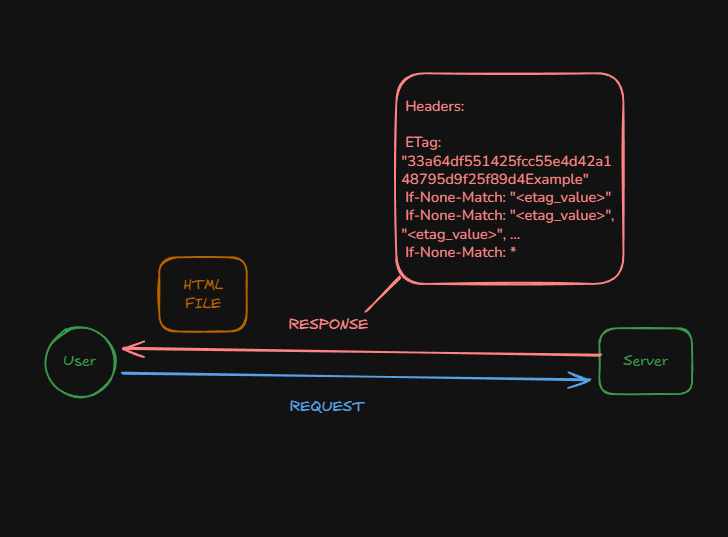

# Generate ETags (Entity Tag) Process

## Resources
- [MDN: ETag](https://developer.mozilla.org/es/docs/Web/HTTP/Reference/Headers/ETag)
- [MDN: If-None-Match](https://developer.mozilla.org/en-US/docs/Web/HTTP/Reference/Headers/If-None-Match)
- [MDN: Conditional requests](https://developer.mozilla.org/es/docs/Web/HTTP/Guides/Conditional_requests)

## Full HTTP flow

### 1) First request (without client cache)

1. Migux locates the static file on disk (static location).
2. Migux computes:
   - **Last-Modified** (file `mtime`)
   - **ETag** (hash or a combination like `size + mtime`)
3. Migux returns **200 OK** with:
   - `ETag: "..."` (or `W/"..."`)
   - `Last-Modified: ...` (optional but recommended)
   - `Cache-Control: ...` (optional)
   - **Response body** (file contents)

✅ Result: the client stores the **ETag**.

---

### 2) Subsequent request (client checks if it changed)

1. Client sends `GET /index.html` with:
   - `If-None-Match: "<stored_etag>"`

2. Migux calculates the current ETag (or fetches it from cached metadata).
3. Migux compares:
   - If it matches → return **304 Not Modified** (no body)
   - If it doesn’t → return **200 OK** with body + new ETag

✅ If it’s **304**: less bandwidth and less I/O.

---

### 3) Special case: `If-None-Match: *`

- If the resource exists and `If-None-Match: *` is received:
  - For **GET/HEAD**, typical behavior is **304** (“it exists, don’t download if any version exists”).
- If it does not exist → normal flow (**404**).

---

### 4) HEAD

- Same as GET, but:
  - **no body**
  - same `ETag` / `Last-Modified`
  - can return **304** if it matches
